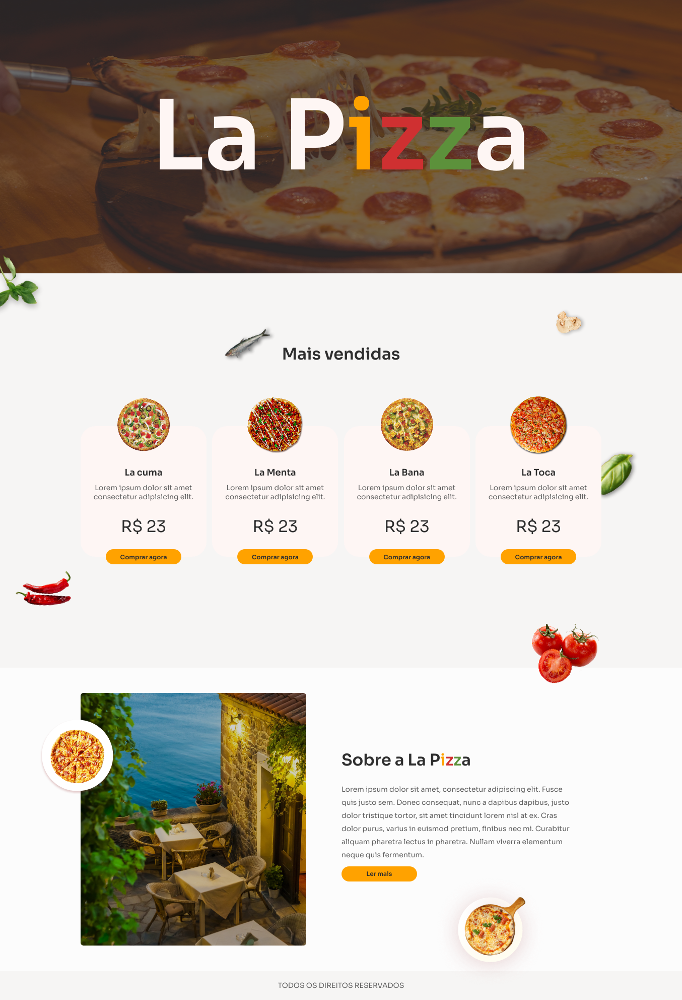

# LaPizza 🍕

  ## 🖥 Projeto
  Projeto desenvolvido para fins de prática e desenvolvimento dos conhecimentos de HTML e CSS
  
Para ver o projeto no Figma, <a href="https://www.figma.com/file/OFPmaR4BYJd7QeChEOzHgL/Desafios---Codel%C3%A2ndia-(Copy)?node-id=31037%3A2">clique aqui</a>.

  ## 👨‍💻 Tecnologias
  As tecnologias usadas nesse projeto foram:
  - [HTML](https://developer.mozilla.org/en-US/docs/Web/HTML)
  - [CSS](https://developer.mozilla.org/en-US/docs/Web/CSS)
  - [JS](https://developer.mozilla.org/en-US/docs/Web/JavaScript)

  ## 🖇 Executar o Projeto
  Para executar o projeto <a href="https://ednaldo-byte.github.io/LaPizza/">clique aqui</a>

  ##  📃 Licença
  Esse projeto possui licença MIT. Para mais detalhes consulte o arquivo [LICENSE](LICENSE.md)
 *
#dailyFrontend
*
